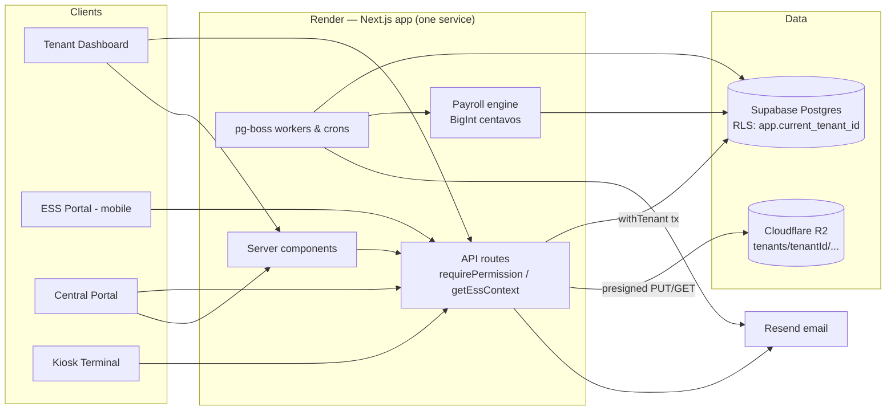

# Sentire Payroll — System Design, Requirements & Actors

> **Status:** Living document. Describes the system **as built** (not aspirational).
> **Product:** Multi-tenant HRIS & Payroll SaaS for Philippine SMEs.
> **Production:** https://payroll.sentire.solutions (Render) · DB on Supabase · Files on Cloudflare R2.

---

## 1. System Overview

Sentire Payroll is a multi-tenant web application that lets Philippine companies run
end-to-end HR and payroll: employee 201 files, time & attendance (DTR), leave,
overtime, loans, statutory contributions (SSS, PhilHealth, Pag-IBIG, BIR withholding),
payroll computation with payslips, and an Employee Self-Service (ESS) portal.
A separate **Central Portal** lets the platform operator (Sentire) manage tenants,
subscriptions, billing, and platform health.

One codebase serves four user-facing surfaces:

| Surface | Route group | Audience |
|---|---|---|
| **Tenant Dashboard** | `(dashboard)` | HR / payroll staff of a client company |
| **Employee Self-Service (ESS)** | `(ess)` | Rank-and-file employees (mobile-first) |
| **Central Portal** | `centralportal` | Platform (Sentire) administrators |
| **Kiosk** | `(kiosk)` | Shared time-clock terminals (PIN + selfie punch) |

---

## 2. Actors

### 2.1 Human actors

| Actor | Surface | Authentication | Authorization |
|---|---|---|---|
| **Platform Super Admin** | Central Portal | NextAuth (email + password; `scope=admin`) | `SystemRole.SUPER_ADMIN`; central RBAC over `CentralModule` (TENANTS, BILLING, SUPPORT, USERS, ROLES) |
| **Central staff** | Central Portal | NextAuth | Central roles with per-module `MANAGE/READ` permissions |
| **Tenant HR / Payroll admin** | Tenant Dashboard | NextAuth (email + password, Google, Microsoft Entra ID) | `SystemRole.TENANT_USER` + custom tenant **Role** with per-module permissions |
| **Approver / Supervisor** | Tenant Dashboard | NextAuth | Same RBAC; typically APPROVE on TIMESHEETS/LEAVES; also DTR approver assignments & approval workflows |
| **Employee** | ESS | ESS session token (company code + employee ID + DOB / PIN / password); invite-gated | Sees only their own data (payslips, DTR, leave, OT, undertime, expense claims, profile) |
| **Kiosk user** | Kiosk | Kiosk device registration + per-employee 6-digit kiosk PIN | Clock in/out (optionally geofenced, with selfie) |
| **Tenant billing contact** | Email only | n/a (receives billing emails; no login) | Receives Monthly / Unpaid / Deactivation notices |

**Tenant RBAC:** permissions are `PermissionModule` × `PermissionAction`:
- Modules: EMPLOYEES, DEPARTMENTS, BRANCHES, PAYROLL, TIMESHEETS, LEAVES, REPORTS, COMPLIANCE, SETTINGS, ROLES, INCIDENTS, MOVEMENTS, DOCUMENTS, AUDIT
- Actions: CREATE, READ, UPDATE, DELETE, APPROVE, EXPORT
- Roles are **custom per tenant** (no hardcoded "HR Manager"); every route is guarded by
  `requirePermission(req, MODULE, ACTION)`; Central routes by `requireCentralPermission`.

### 2.2 System actors

| Actor | Role |
|---|---|
| **pg-boss job runner** | Executes async jobs & crons inside the Node app (see §5.4) |
| **Resend** | Outbound transactional email (11-template family, §5.5) |
| **Cloudflare R2** | Object storage: 201 documents, training certificates, employee photos, logos, kiosk selfies (presigned PUT/GET) |
| **Supabase Postgres** | System of record; enforces tenant isolation via RLS |

### 2.3 ESS access lifecycle (invite-gated)

`NOT_INVITED → INVITED → ACTIVE → DISABLED` (with optional **scheduled deactivation**
at a future date + reason, enforced hourly by cron + at the auth gate). Employees never
get access automatically; HR activates or emails a one-time invite link (7-day expiry).
A work email on file is required before activation. Forgot-password issues a 1-hour
single-use token.

---

## 3. Requirements

### 3.1 Functional requirements (by module, as built)

**Employee management (201 file)**
- 12-section Add/Edit wizard (Personal, Government IDs, Job, Salary, Family, Contact,
  Health, Directory privacy, Others, Education, Experience, Training); save allowed from
  any step once required fields are valid.
- Auto-generated Employee IDs (`EMP-0001` style; per-tenant prefix/padding/year reset).
- Profile page with photo upload (R2), tabs, kiosk PIN, linked user account.
- Documents (201 file) uploads with categories + confidential flag; presigned direct-to-R2.
- Education / Work Experience / Training histories (repeatable records; training
  certificates upload to R2 with expiry tracking).
- Movements (promotion/transfer/salary change), Placement, Employment Terms,
  offboarding with final-pay run.

**Time & Attendance**
- DTR records with company-timezone anchoring; shift schedules; night-shift
  differential window (fixed compute, configurable window); premium rates
  (OT/ND/holiday multipliers, DOLE defaults); holiday calendar; OT applications and
  undertime requests with approval; DTR submission → supervisor notification;
  kiosks (registered devices, geofences, selfie punches).

**Leave**
- Leave types & policies, balances/ledger, transactions with approval workflows,
  monthly accrual cron; ESS self-filing.

**Payroll**
- Pay frequencies: monthly / semi-monthly / weekly / daily; payroll books & runs
  (REGULAR, FINAL_PAY, THIRTEENTH_MONTH, YEAR_END special runs).
- Gross-to-net engine in **BigInt centavos** (half-up rounding primitive; no floats).
- PH statutory: SSS, PhilHealth, Pag-IBIG tables + BIR withholding; statutory cutoff
  rule configurable; 13th-month basis configurable (strict DOLE vs. inclusive).
- Pay components (earnings/deductions, taxable flags), per-employee assignments,
  period inputs, adjustments.
- Loans: SSS/company/etc., installment schedules, **max-deduction % of gross**
  safeguard blocking over-extension, and a run-time **net-pay floor** that defers
  installments so net pay never goes negative (FINAL_PAY exempt by default).
- Payslip PDF generation to R2 + publish job; ESS "payslip ready" emails.
- Government remittance reports; bank files.

**Employee Self-Service**
- Mobile-first: home, clock in/out, payslips, leave, DTR, OT, undertime, expense
  claims, assets, profile; PIN or password login; invite/activation flow.

**Recruitment (ATS)**, **Incidents**, **Announcements**, **Expense claims**,
**Assets**, **Analytics**, **AI assistant** (payslip Q&A, anomaly checks).

**Central Portal (platform)**
- Tenant CRUD & health, segmentation; billing packages (centavo prices, tax bps),
  subscriptions (assign/change/cancel), invoices (draft/issue), manual payments;
  support tickets; central users & roles; platform audit feed; compliance dashboards.
- Billing lifecycle emails: Monthly notice on invoice issue; Unpaid notice via daily
  overdue cron (OPEN→OVERDUE, once per invoice); Deactivation notice on subscription
  cancellation with outstanding balance. Grace windows via
  `BILLING_SETTLE_GRACE_DAYS` / `BILLING_DEACTIVATE_GRACE_DAYS` (default 7).

**Auditability**
- `writeAuditLog` on sensitive mutations (actor, entity, changes, IP); AUDIT module
  permission to read; platform-level audit feed in Central.

### 3.2 Non-functional requirements

| Concern | Requirement / approach |
|---|---|
| **Tenant isolation** | Postgres **RLS** (`ENABLE`+`FORCE`, `tenant_isolation` policy on `tenantId = current_setting('app.current_tenant_id')`). All tenant reads/writes run through `withTenant(tenantId, tx ⇒ …)` which sets the GUC transaction-locally. Admin/system paths use `prismaAdmin` (BYPASSRLS) deliberately and sparingly. |
| **Money correctness** | All amounts are **BigInt centavos**; single HALF-UP rounding primitive; `split()` preserves every centavo; conversion only at system boundaries. |
| **Field-level encryption** | AES-256-GCM at the Prisma layer for sensitive fields (e.g. bank account numbers) with HMAC companions for lookups; `ENCRYPTION_KEY` (32-byte base64) required. |
| **Secrets & preflight** | Boot-time env check + `/api/health`: critical (DATABASE_URL, ENCRYPTION_KEY) vs. warnings (RESEND_API_KEY, email-asset base). Misconfig surfaces at boot, not as runtime 500s. |
| **File security** | Confidential HR files never public: presigned PUT for upload, presigned GET (or 302) for download; storage keys namespaced `tenants/{tenantId}/…` and validated on write. |
| **AuthN** | NextAuth v5 JWT (httpOnly); credentials + Google + Microsoft Entra ID; separate ESS token sessions (hashed tokens, revocable); kiosk PINs bcrypt-hashed. |
| **Self-protection** | Users cannot edit their own employee record (`isSelf` guard). |
| **Reliability of async work** | pg-boss with retry (3×, 60s delay); idempotent crons; email sends are best-effort try/catch so business actions never fail on email misconfig. |
| **Migrations** | Hand-written, idempotent SQL (`IF NOT EXISTS`, guarded enum/FK/policy creation); validated on a throwaway Postgres (`migrate deploy` + `status` + re-run + drift check) before merge. |
| **Timezone correctness** | Per-tenant IANA timezone (default Asia/Manila) anchors DTR day boundaries, NSD window, statutory month-end. |
| **Ops posture** | Auto squash-merge PR workflow; `tsc`, ESLint, Vitest (225+), `next build` green before every merge. Production DB should run on Supabase Pro (no auto-pause, PITR backups). |

---

## 4. Architecture

### 4.1 Technology stack

| Layer | Choice |
|---|---|
| Framework | **Next.js 16** (App Router, RSC; custom build — see `AGENTS.md`) |
| Language | TypeScript (strict) |
| ORM / DB | **Prisma 7** (pg adapter) → **Supabase Postgres 17** (RLS) |
| Jobs | **pg-boss** (Postgres-backed queue + cron), registered via instrumentation |
| Auth | NextAuth v5 (JWT) + bespoke ESS token sessions |
| Storage | **Cloudflare R2** (S3-compatible; zero-egress) via AWS SDK presigned URLs |
| Email | **Resend**; hand-built HTML template family in `src/lib/emails/` |
| UI | React + Tailwind + shadcn-style components; TanStack Table; RHF + Zod |
| Validation | **Zod** schemas per API route (blank→null preprocessors for optional fields) |
| Hosting | **Render** web service (Node runtime; jobs run in-process) |

### 4.2 Component diagram



### 4.3 Multi-tenancy model

- Single database, single schema; every tenant-owned row carries `tenantId`.
- **RLS enforced at the DB** (policies + `FORCE`), not just app filters. The app role
  (`payroll_app`) is non-superuser; `withTenant` sets
  `app.current_tenant_id` per transaction (`set_config(..., true)`), safe under pooling.
- `prismaAdmin` (BYPASSRLS role) is reserved for: auth flows, cross-tenant Central
  Portal operations, public token-authenticated endpoints (ESS activate/reset), and
  system jobs — each of which scopes queries explicitly.

### 4.4 Background jobs (pg-boss)

| Job | Trigger | Purpose |
|---|---|---|
| `payroll.run` | enqueue on Run | Gross-to-net compute for a payroll book |
| `payslip.publish` | enqueue | Render payslip PDFs → R2, notify employees |
| `ot.approved` | enqueue | Notify employee of OT approval |
| `dtr.submitted` | enqueue | Notify supervisor of DTR submission |
| `leave.accrual` | cron (monthly, 00:05 PH) | Accrue leave balances |
| `ess.deactivation` | cron (hourly) | Enforce scheduled ESS deactivations; revoke sessions |
| `billing.overdue` | cron (daily, 00:15 PH) | Flip past-due OPEN invoices → OVERDUE; send Unpaid notice once |

### 4.5 Transactional email family (`src/lib/emails/`)

Eleven templates, one shared 600px shell, four surfaces (SELF-SERVICE, PAYROLL,
BILLING, CENTRAL) each with its own support/reply-to address:

1. Employee Onboarding (ESS invite; reply-to = tenant contact email) ·
2. Employee Reset Password · 3. Reset-Password Notice ·
4. Tenant Onboarding · 5. Tenant Admin Reset ·
6. Monthly Billing Notice · 7. Unpaid Billing Notice · 8. Deactivation Notice ·
9. Admin Onboarding · 10. Admin Reset · 11. Admin Reset Notice.

Images are served from the app itself (`public/email-assets/` via
`NEXT_PUBLIC_APP_URL`), overridable with `EMAIL_ASSET_BASE_URL` (CDN/R2).

### 4.6 File-upload pattern (uniform)

```
Browser ──POST /…/presign──▶ API (permission + Zod + key = tenants/{tenantId}/…)
Browser ◀── uploadUrl, storageKey ──
Browser ──PUT file──▶ R2  (XHR w/ progress where UX needs it)
Browser ──POST/PATCH metadata + storageKey──▶ API (prefix ownership check, persist)
Download: API issues presigned GET / 302; public URL only for non-sensitive assets.
```

Used by: 201 documents, training certificates, employee photos, company logos,
kiosk selfies.

### 4.7 Data model (high level)

~76 models. Core clusters:

- **Tenant** ⟶ users, roles(+permissions), departments/branches/positions/levels,
  settings (payroll defaults, employee-ID format, timezone, deduction caps).
- **Employee** ⟶ statutory IDs, employment terms (salary history), placements,
  movements, documents, education/experience/training, leave balances, loans,
  ESS fields (access status, PIN/password hashes, invites, password resets, sessions).
- **Payroll**: PayrollBook → PayrollSheet (per employee; earnings/deductions JSON,
  loan-deferral flags) → Payslip; PayComponent, PeriodInput, Adjustment.
- **Attendance**: DTRRecord, DTRSubmission, ShiftSchedule, OTApplication,
  UndertimeRequest, Holiday, PremiumRateConfig, Kiosk, Geofence.
- **Platform**: BillingPackage, TenantSubscription, Invoice, Payment,
  SubscriptionEvent, SupportTicket, CentralRole/Permission, AuditLog.

### 4.8 Environment configuration

| Variable | Criticality | Purpose |
|---|---|---|
| `DATABASE_URL` / `DIRECT_DATABASE_URL` | critical | Postgres (pooled / direct) |
| `ENCRYPTION_KEY` | critical | AES-256-GCM field encryption (32-byte base64) |
| `NEXT_PUBLIC_APP_URL` | critical-ish | Absolute links (emails, activation), email assets |
| `RESEND_API_KEY` | warning | Outbound email |
| `R2_ACCOUNT_ID/ACCESS_KEY_ID/SECRET_ACCESS_KEY/BUCKET` | warning | File storage |
| `R2_PUBLIC_URL` | optional | Public asset domain (else presigned GETs) |
| `EMAIL_ASSET_BASE_URL` | optional | CDN override for email images |
| `BILLING_PORTAL_URL` | optional | Pay-CTA target in billing emails |
| `BILLING_SETTLE_GRACE_DAYS` / `BILLING_DEACTIVATE_GRACE_DAYS` | optional | Dunning copy windows (default 7) |

Preflight: `logEnvCheck()` at boot + `/api/health` report problems/warnings.

---

## 5. Key design decisions (and why)

1. **DB-enforced RLS over app-only filtering** — a missed `where tenantId` cannot leak
   data; the policy blocks it at Postgres.
2. **BigInt centavos everywhere** — payroll cannot tolerate float drift; one rounding
   primitive makes audits reproducible.
3. **Invite-gated ESS** — employees are provisioned deliberately (payroll data is
   sensitive); work email required so account recovery is always possible.
4. **Presigned direct-to-R2 uploads** — file bytes never transit the app server;
   credentials never reach the browser; R2 chosen for zero egress on payslip/document
   serving.
5. **pg-boss in-process** — no extra infrastructure; queue durability rides on
   Postgres; acceptable at current scale (single Render service).
6. **Best-effort email** — a billing action or invite must never 500 because Resend is
   down; failures log and surface for resend.
7. **Idempotent hand-written migrations** — safe to re-run; validated against a real
   Postgres before merge because `_prisma_migrations` history can drift from reality.
8. **One wizard for Add/Edit employee** — a single source of truth for the 201 form;
   child-record sections (education/training) activate once the employee exists.

---

## 6. Known gaps / roadmap candidates

- **Manual-payment billing page** (`/pay/<token>`: invoice view + proof-of-payment
  submission + Central verification) — designed, not yet built.
- Grace-window dates in billing emails are **copy-only**; no automated suspension job.
- Employee profile tabs Documents / Leave Ledger / Payslips are placeholders (data
  lives on dedicated pages).
- "Soon" sidebar items: Legal Documents, expense categories/types, leave planner, etc.
- Payment gateway integration (PayMongo/Xendit) — schema has gateway fields reserved.
- Supabase **Pro** upgrade for production (no auto-pause; PITR backups) — operational
  prerequisite before real customer payroll.
